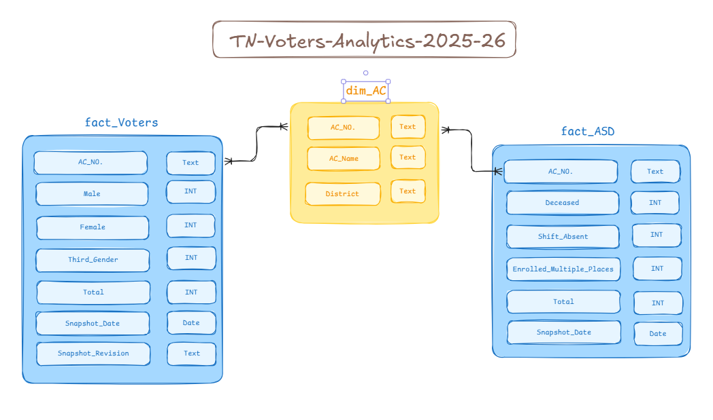

# Data Model Documentation 📐

This document outlines the Star Schema architecture used in the TN Voter Analytics Dashboard. The model centers around a shared Dimension table (`dim_AC`) that filters multiple Fact tables representing different snapshots of voter data.

## 1. Model Overview

Architecture: Star Schema (1 Dimension, 3 Facts)

Relationship Cardinality: One-to-Many (1:*)

Cross Filter Direction: Single (Dimension filters Facts)

---

## 2. Dimension Table 🏷️

`dim_AC`
**Role:** The primary filtering table for the dashboard. It contains the unique list of all 234 Assembly Constituencies.

**Key Columns:**

- `AC_No.`: Unique identifier for each Assembly Constituency.
- `AC_Name`: Full name of the Assembly Constituency.
- `District`: The district to which the AC belongs.

| Column   | Data Type | Description |
|----------|-----------|-------------|
| AC_No.   | Text      | Primary Key (PK). Unique identifier for each constituency (e.g., `1`). |
| AC_Name  | Text      | Name of the Assembly Constituency (e.g., `Gummidipoondi`). |
| District | Text      | Administrative district the AC belongs to. |

---

## 3. Fact Tables 📊

### A. fact_Voters

**Role:** Baseline voter snapshot as of both SSR and SIR.

| Column         | Data Type     | Description |
|----------------|---------------|-------------|
| AC_No.         | Text          | Foreign Key (FK). Links to `dim_AC_reference`. |
| Male           | Whole Number  | Count of male voters. |
| Female         | Whole Number  | Count of female voters. |
| Third_Gender   | Whole Number  | Count of third gender voters. |
| Total          | Whole Number  | Total electorate count. |
| Snapshot_Date  | Date          | Fixed snapshot date: `2025-01-06`. |

### B. fact_ASD

**Role:** Stores audit data regarding deleted or shifted voters during the Special Intensive Revision 2026.

| Column              | Data Type     | Description |
|---------------------|---------------|-------------|
| AC_No.              | Text          | Foreign Key (FK). Links to `dim_AC_reference`. |
| Deceased            | Whole Number  | Number of voters removed due to death. |
| Shifted_Absent      | Whole Number  | Number of voters shifted or absent. |
| Enrolled_Multiple   | Whole Number  | Duplicate voter entries removed. |
| Total               | Whole Number  | Total ASD count. |
| Snapshot_Date       | Date          | Fixed snapshot date: `2026-01-01`. |
| Snapshot_Date       | Text          | Snapshot Revision: `SSR (Jan 2025)` or `SIR (DEC 2025)`. |

---

## 4. Relationships 🔗

### The model enforces referential integrity through the following active relationships:

| From Table           | To Table                    | Join Key | Active |
|----------------------|-----------------------------|----------|--------|
| dim_AC     | fact_Voters    | AC_No.   | ✅ Yes |
| dim_AC_reference     | fact_ASD         | AC_No.   | ✅ Yes |

## 5. Usage Notes 📝

- The `dim_AC` table serves as the central filter for all visualizations, ensuring consistent constituency selection across different voter snapshots.
- Each Fact table captures a specific temporal snapshot, allowing for comparative analysis of voter demographics and roll integrity over time.
- The `Snapshot_Date` column in each Fact table is static, representing the date of data capture, and is not intended for dynamic filtering.
- The `fact_ASD` table includes a `Snapshot_Revision` column to differentiate between data from the SSR and SIR processes.
- Ensure that any new visualizations or measures respect the established relationships to maintain data integrity and accuracy.
